# the_polite_pup

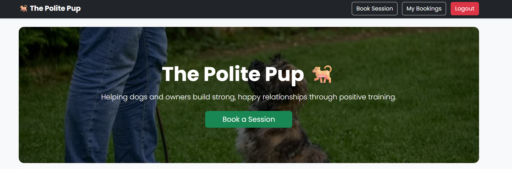
🔗 **Live Site:**  
https://the-polite-pup-ad968cdaf660.herokuapp.com/

## Overview

**The Polite Pup** is a full-stack Django web application designed for a professional dog training business.  
The site allows users to learn about the trainer, understand available training services, and **register, log in, and book training sessions online**.

The project focuses on:
- Clear user experience
- Secure authentication
- Real-world CRUD functionality
- Responsive design
- Accessibility and performance optimisation
- Deployment to Heroku with a production database

This is a solo project built using **Django, Python, HTML, CSS, Bootstrap, and PostgreSQL**.

---

## User Experience (UX) Design

The site is designed to feel:
- Friendly and welcoming
- Professional and trustworthy
- Easy to navigate for all users, including those less comfortable with technology

### Key UX Decisions
- Clear call-to-action buttons (Register / Book a Session)
- Simple navigation with consistent layout
- Visual proof of credibility using training images
- Forms with validation and feedback
- Mobile-first responsive design

---

## Target Audience

- Dog owners looking for professional training
- New puppy owners
- Owners seeking behavioural or obedience support
- Users with varying levels of technical ability

---

## Typography

- **Poppins** (Google Fonts)  
  Used throughout the site to create a friendly yet professional tone.
- Sans-serif fallback fonts included for accessibility and performance.

---

## Features

### 🏠 Home Page
- Hero section introducing the brand

- Clear explanation of services
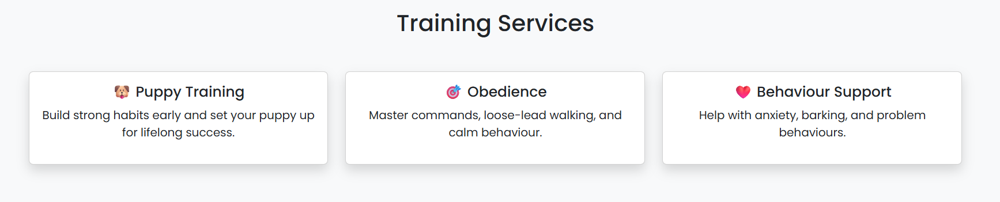
- Trainer profile
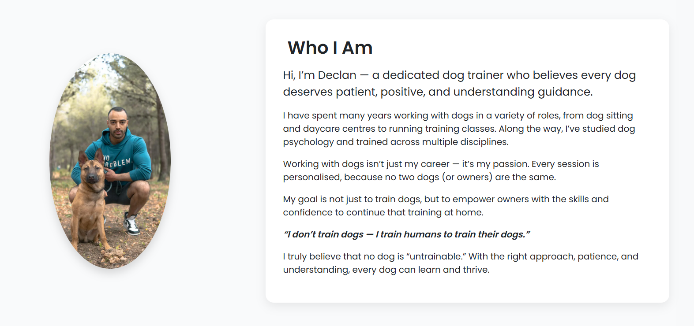
and
mission statement
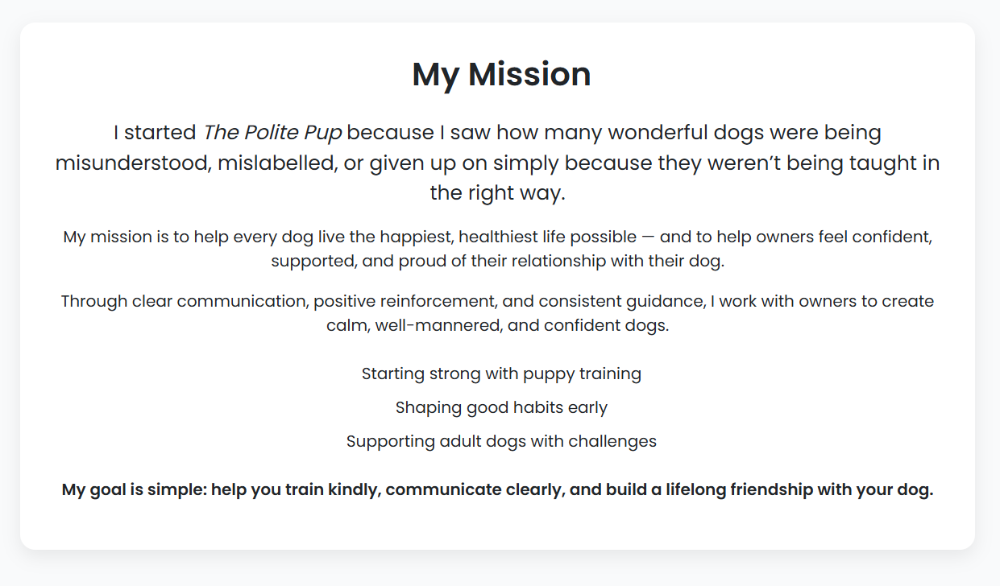
- Image carousel showing real training sessions
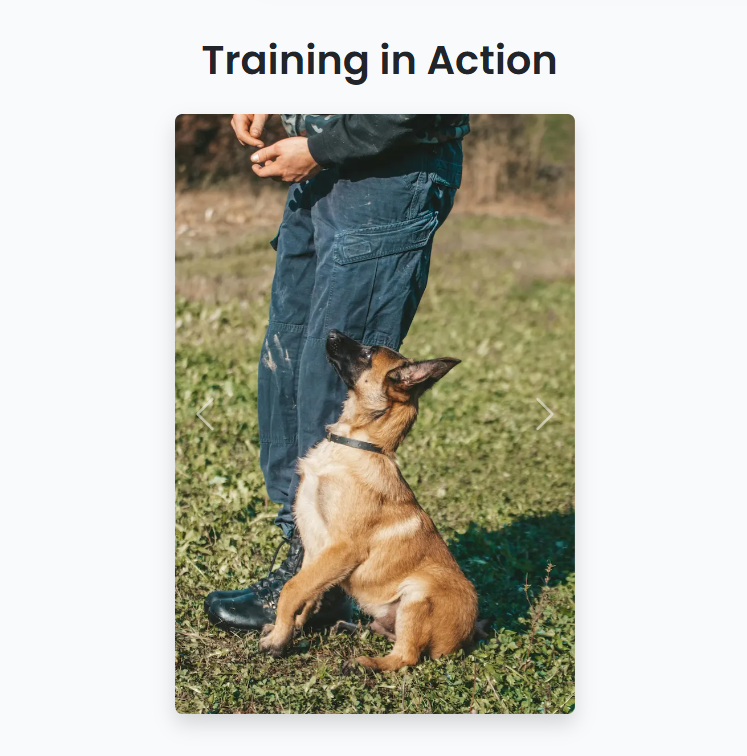

---

### 👤 User Authentication
- User registration
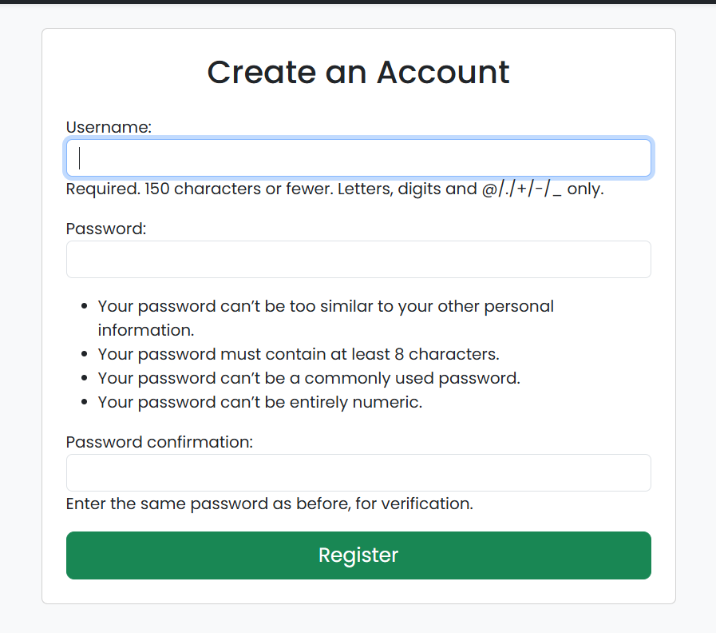
- Secure login and logout
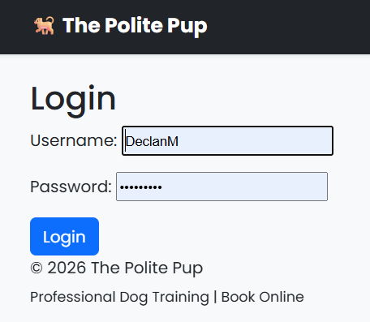
- CSRF protection enabled
- Session-based authentication

---
### 📅 Booking System (CRUD)
Authenticated users can:
- Create a booking

- View their bookings
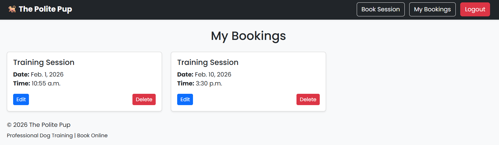
- Edit existing bookings
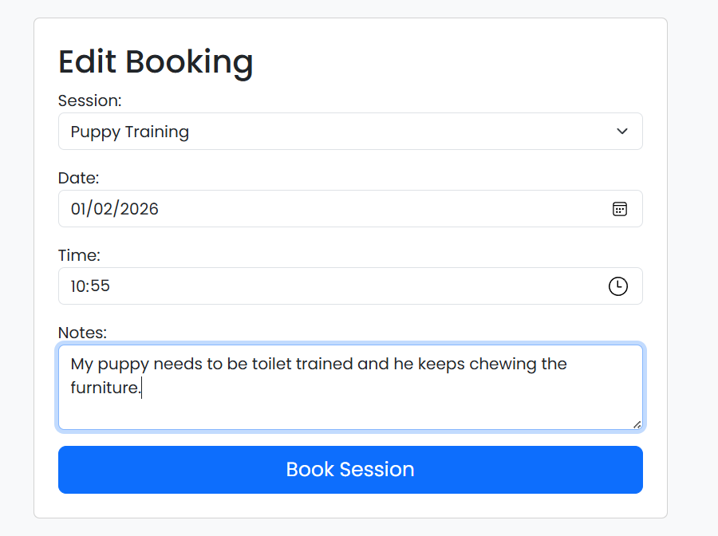
- Delete bookings
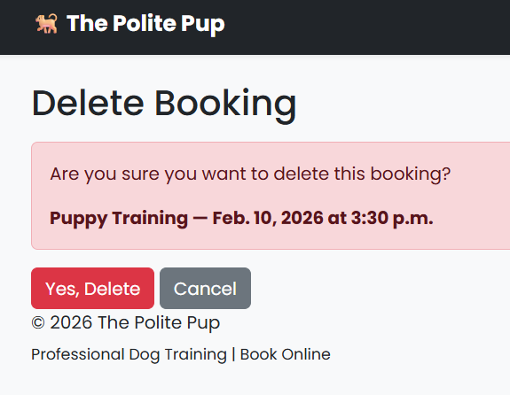

Each booking includes:
- Training type (Puppy / Obedience / Behaviour)
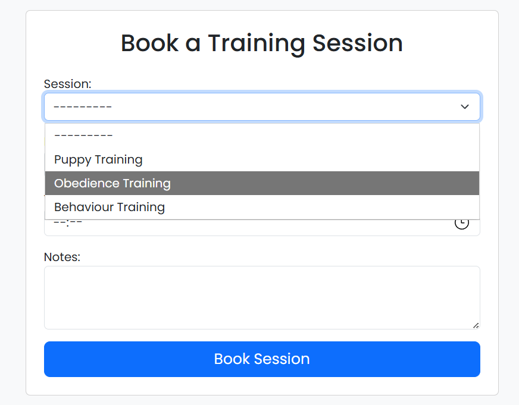
- Date
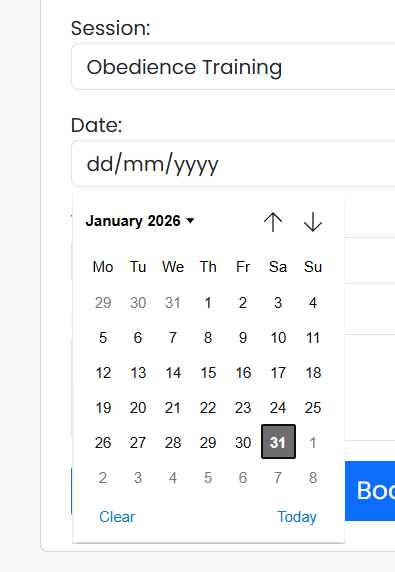
- Time
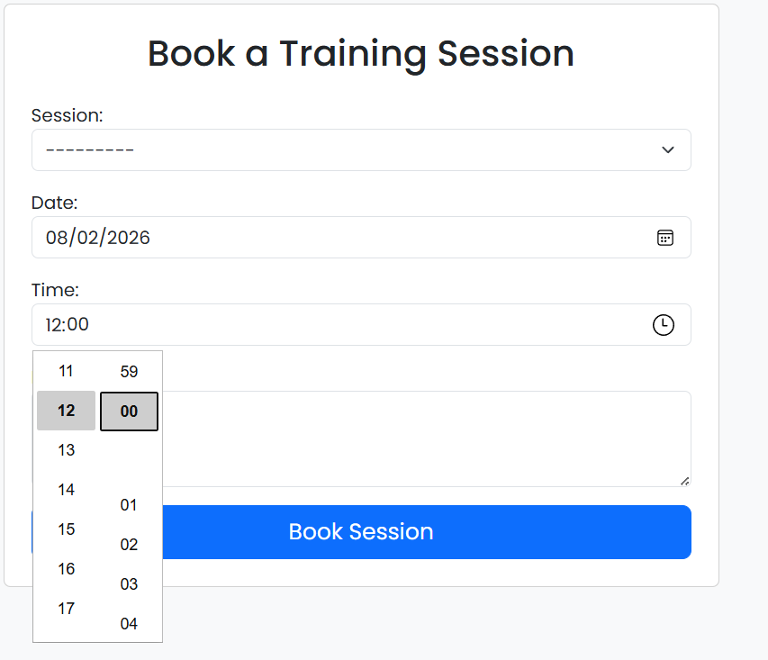
- Notes
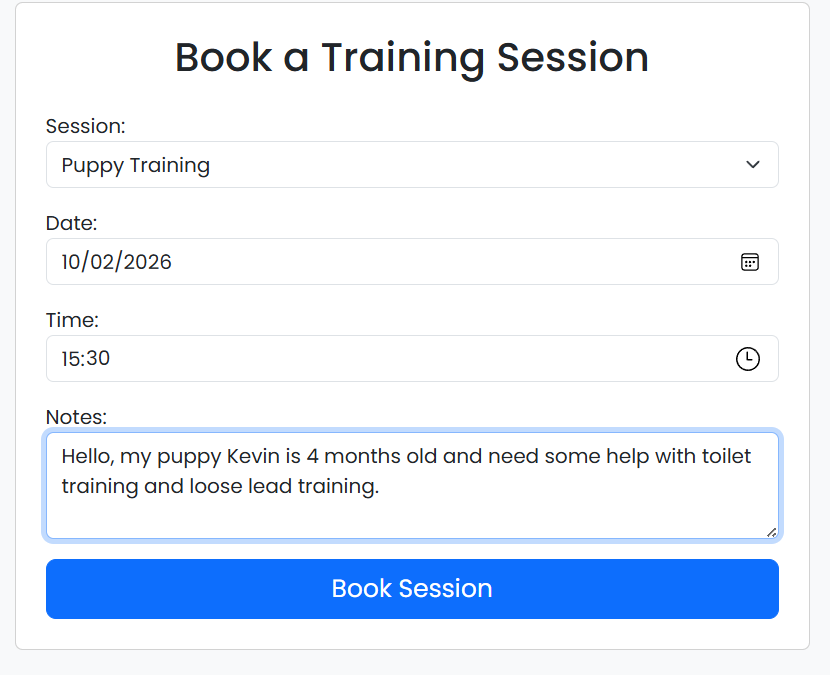

---
### 🔐 Admin Panel]
- Superuser access
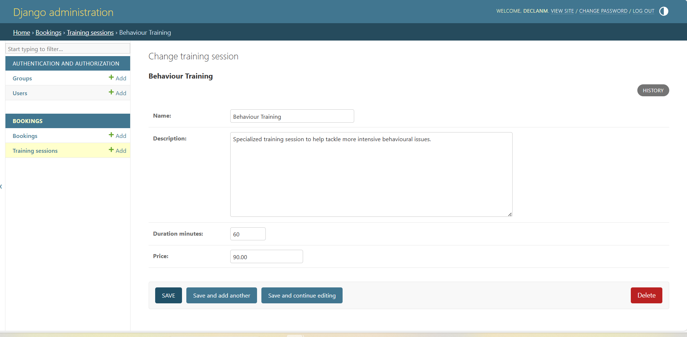
- Full management of users and bookings
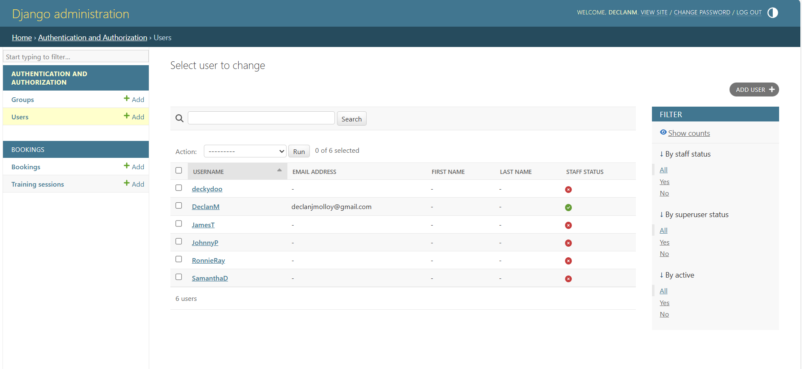

---

### 📱 Responsive Design
- Fully responsive across:
  - Mobile
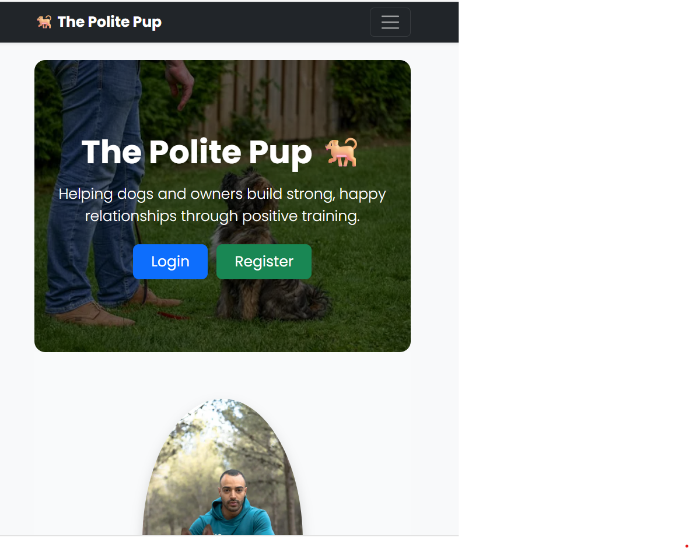
  - Tablet
  - Desktop
- Tested using browser DevTools and real devices

---

## Future Features

- Email confirmation for bookings
- Payment integration
- Trainer availability calendar
- User profile page
- Testimonials section
- Password reset functionality

---

## Tools & Technologies Used

---

### Databases
- SQLite (development)
- [PostgreSQL](https://www.postgresql.org) used as the relational database management.

---

### Languages used
- [HTML](https://en.wikipedia.org/wiki/HTML) - Used for the main site content.
- [CSS](https://en.wikipedia.org/wiki/Cascading_Style_Sheets) -Used for styling and colours
- [Bootstrap](https://getbootstrap.com) used as the front-end CSS framework for modern responsiveness and pre-built components.
- [JavaScript](https://en.wikipedia.org/wiki/JavaScript) - Used to support interactive functionality.
- [Google Dev Tools](https://developer.chrome.com/docs/devtools) - Used for troubleshooting, testing responsiveness, and styling.
- [GitHub](https://github.com/) - Used to save and store the project files.
- [Gitpod](https://ona.com/) - Used as a cloud-based IDE for development.
- [Git](https://git-scm.com/) - Used for version control. (git add, git commit, git push)
- [Google Fonts](https://fonts.google.com/) - Imported fonts used throughout the website.
- [Heroku](https://dashboard.heroku.com/) - Live deployment of the site was hosted here
- [Django](https://www.djangoproject.com/) - Framework that helped build the site
- [Gunicorn](https://gunicorn.org/) used for WSGI server

---

## Deployment

### Heroku Deployment

The project was deployed to Heroku using the following steps:

1. Create Heroku app
2. Add PostgreSQL add-on
3. Configure environment variables:
   - SECRET_KEY
   - DATABASE_URL
4. Configure settings for production:
   - DEBUG = False
   - ALLOWED_HOSTS
   - CSRF and session security
5. Collect static files
6. Run migrations
7. Scale web dyno

The live application can be found here:  
https://the-polite-pup-ad968cdaf660.herokuapp.com/

Heroku needs two additional files in order to deploy properly.
- requirements.txt
- Procfile

You can install this project's **requirements** (where applicable) using:
- pip3 install -r requirements.txt

If you have your own packages that have been installed, then the requirements file needs updated using:
- pip3 freeze --local > requirements.txt

The **Procfile** can be created with the following command:
- echo web: gunicorn app_name.wsgi > Procfile
- *replace **app_name** with the name of your primary Django app name; the folder where settings.py is located*

For Heroku deployment, follow these steps to connect your own GitHub repository to the newly created app:

Either:
- Select **Automatic Deployment** from the Heroku app.

Or:
- In the Terminal/CLI, connect to Heroku using this command: heroku login -i
- Set the remote for Heroku: heroku git:remote -a app_name (replace *app_name* with your app name)
- After performing the standard Git add, commit, and push to GitHub, you can now type:
	- git push heroku main

The project should now be connected and deployed to Heroku!
---

## Local Deployment

### Cloning the Repository

1. Go to the [GitHub repository.] (https://github.com/Dmolloy/the_polite_pup).
2. Locate the Code button above the list of files and click it.
3. Select if you prefer to clone using HTTPS, SSH, or GitHub CLI and click the copy button to copy the URL to your clipboard.
4. Open Git Bash or Terminal.
5. Change the current working directory to the one where you want the cloned directory.
6. In your IDE Terminal, type the following command to clone my repository:
- git clone https://github.com/Dmolloy/the_polite_pup.git
7. Press Enter to create your local clone.

### Forking 
By forking the GitHub Repository, we make a copy of the original repository on our GitHub account to view and/or make changes without affecting the original owner's repository. You can fork this repository by using the following steps:

1. Log in to GitHub and locate the [GitHub Repository](https://github.com/Dmolloy/the_polite_pup.git).
2. At the top of the Repository (not top of page) just above the "Settings" Button on the menu, locate the "Fork" Button.
3. Once clicked, you should now have a copy of the original repository in your own GitHub account!

## Testing

For all testing, please refer to the [TESTING.md](TESTING.md) file.

## Bugs

### Fixed Bugs

| Bug | Evidence | Fix |
|---|---|---|
| Chrome signup CSRF error | 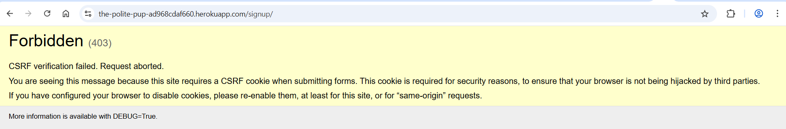 | Ensured CSRF cookie was set on signup view and verified registration works across browsers. |
| Mobile dropdown not selectable |  | Re-created training session records in production database and validated dropdown selection works. |

There are no other known bugs.

## Credits
- [Stack Overflow](https://stackoverflow.com/)- For help with learning proper syntax and troubleshooting tips
- [Code Institute](https://codeinstitute.net/) - Tutorials and engaging course work.
- [youtube](https://www.youtube.com/watch?v=PBcqGxrr9g8) - For helping with understanding live deployment using Heroku
- [favicon.io](https://favicon.io/emoji-favicons/books/) - For providing the favicon
- [Squoosh](https://squoosh.app/) - For resizing and converting images that were too big and causing performance issues.
-[Pexels](https://www.pexels.com/) - Where I sourced all of my iamges for this project.

## Acknoledgements
I would like to thank [Code Institute](https://codeinstitute.net/) for the lessons and guidance in working on this project. The [Discord Community](https://discord.com/) for the support to help continue moving with the project. 